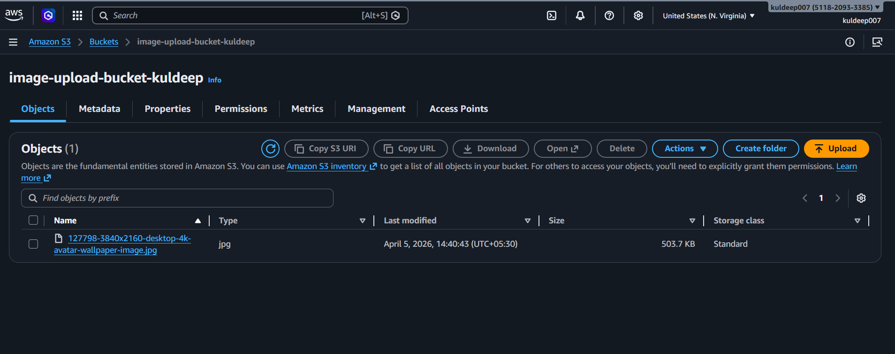
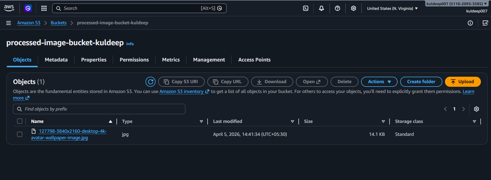
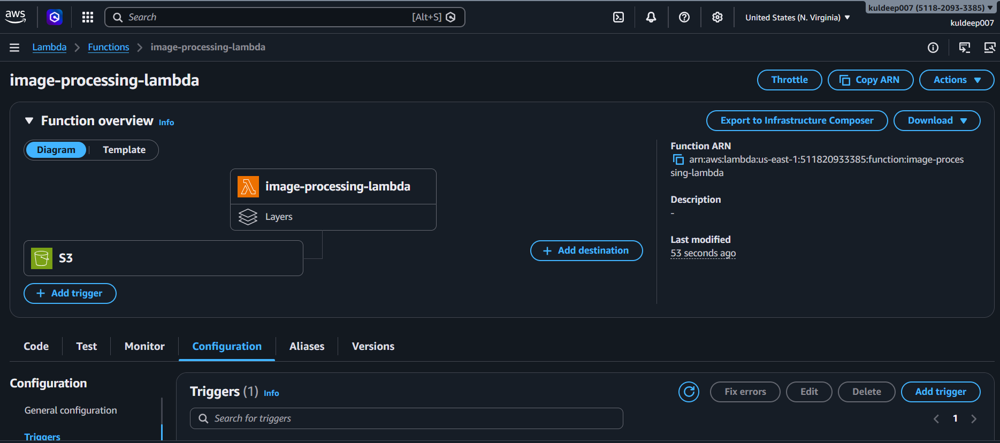
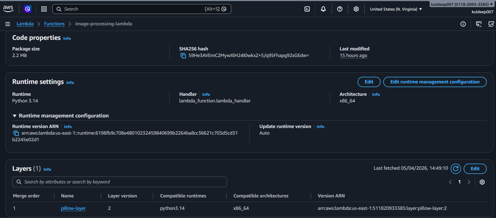
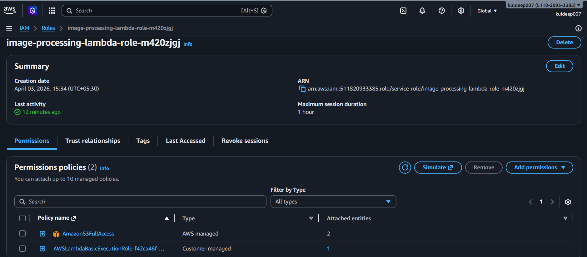
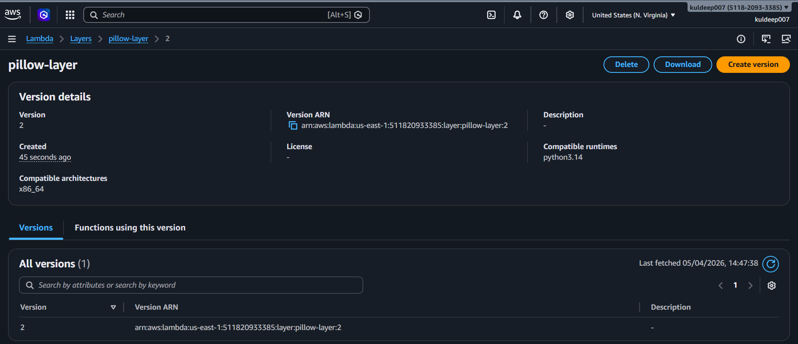

# 📸 Project Screenshots

Visual documentation of the Serverless Image Processing Pipeline.

---

## 📥 S3 Input Bucket

> Input bucket containing the original uploaded image (503.7 KB)

---

## 📤 S3 Output Bucket

> Output bucket showing the processed image (14.1 KB) — 97% size reduction!

---

## ⚡ Lambda Function Overview

> Lambda function with S3 trigger connected

---

## 🔧 Lambda Runtime & Layers

> Runtime settings showing Python 3.14 and Pillow layer attached

---

## 🔑 IAM Permissions

> IAM Role with AmazonS3FullAccess policy attached

---

## 📦 Pillow Layer Details

> Custom Pillow layer (version 2) for Linux-compatible image processing
